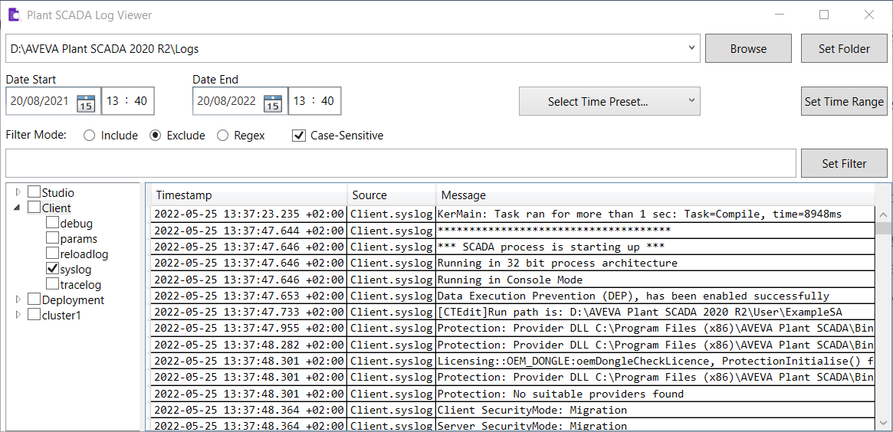

# Plant SCADA Log Viewer
Plant SCADA Log Viewer is a tool to analyze Citect/Plant SCADA log files directory.
A portable compiled version can be downloaded [here](https://github.com/girasella/plantscada_logviewer/raw/main/Build/PlantSCADA_Logviewer.zip). 

It requires .NET Framework 6.0 to work. (https://dotnet.microsoft.com/en-us/download/dotnet/6.0)

Usage:

- Select a Citect/Plant SCADA Logs directory and click "Set Folder" to load the log groups in the tree view box. 

- Check/Uncheck an item on the tree view box to view/hide the log entries. 

- Set up start date and end date, then click "Set Time Range" to restrict log search to a given time interval.

- Set up filter mode and type a filter string, then press Enter or click "Set Filter" to filter log messages. 

The [application icon](https://freeicons.io/office-and-business-4/document-search-verified-research-business-icon-111958) by [ColourCreatype](https://freeicons.io/profile/5790) is used under [CC BY-NC-SA](https://creativecommons.org/licenses/by-nc-sa/3.0/) license. Icon colors have been changed.
