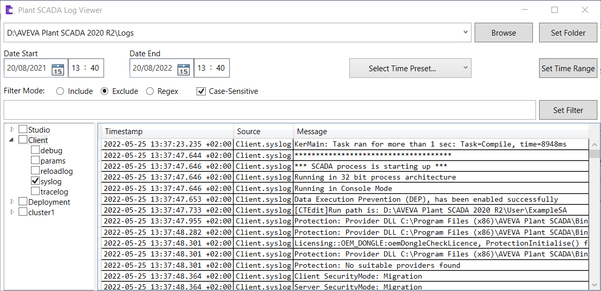

# plantscada_logviewer
PlantSCADA Logviewer is a tool to analyze Citect/Plant SCADA log files directory.
It requires .NET Framework 6.0 to work. (https://dotnet.microsoft.com/en-us/download/dotnet/6.0)

Usage:

- Select a Citect/Plant SCADA Logs directory and click "Apply" to load the log groups in the tree view box. 

- Check/Uncheck an item on the tree view box to view/hide the log entries. 

- Set up start date and end date, then click "Apply" to restrict log search to a given time interval.

- Set up filter mode and type a filter string, then press Enter or click "Apply" to filter log messages. 

